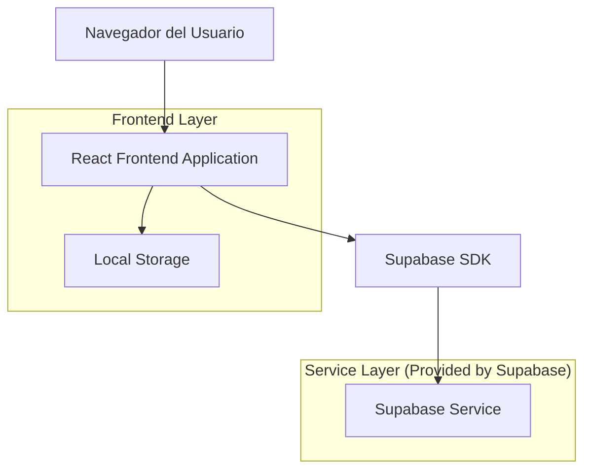
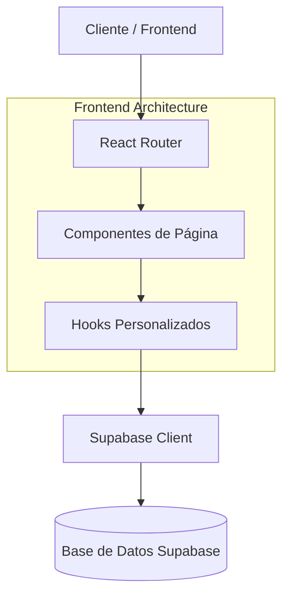
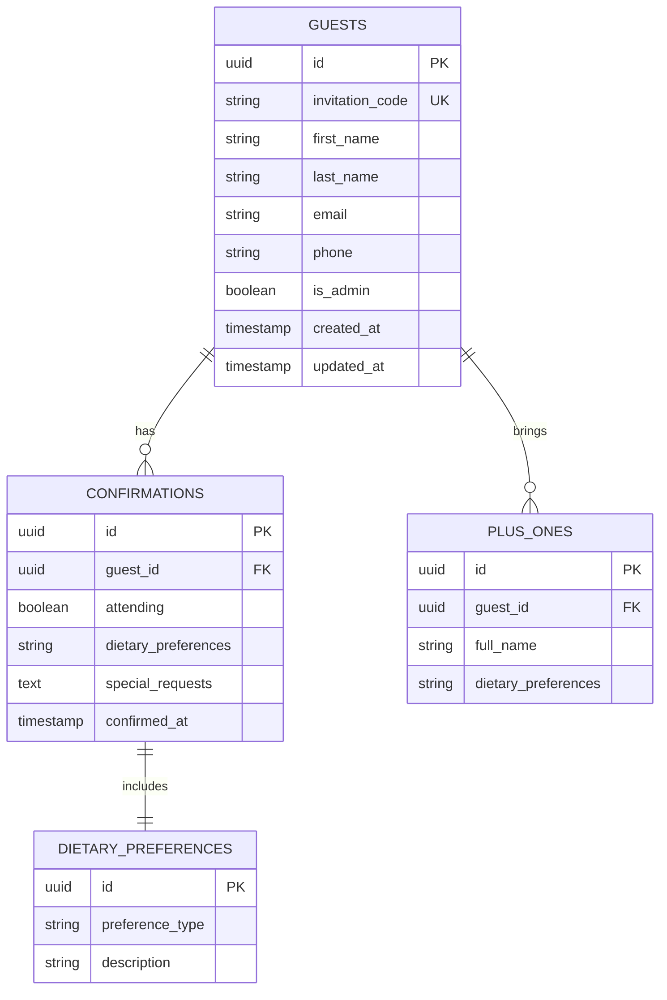

# Documento de Arquitectura Técnica - Sitio Web de Registro de Invitados para Boda

## 1. Diseño de Arquitectura



## 2. Descripción de Tecnologías

* Frontend: React\@18 + CSS3 + Vite

* Backend: Supabase (Authentication, Database, Storage)

* Styling: CSS Modules + Custom CSS

* State Management: React Hooks (useState, useEffect, useContext)

* Form Handling: React Hook Form

* Routing: React Router DOM

## 3. Definiciones de Rutas

| Ruta                | Propósito                                               |
| ------------------- | ------------------------------------------------------- |
| /                   | Página de inicio con hero section y acceso rápido       |
| /registro/:codigo   | Página de registro de invitado con código de invitación |
| /informacion        | Página con detalles del evento, ubicación y horarios    |
| /confirmacion       | Página de confirmación exitosa del registro             |
| /admin              | Panel de administración para los novios                 |
| /admin/estadisticas | Vista de estadísticas y métricas de confirmaciones      |

## 4. Definiciones de API

### 4.1 API Principal

**Autenticación de invitados**

```
POST /api/auth/guest
```

Request:

| Nombre del Parámetro | Tipo del Parámetro | Requerido | Descripción                |
| -------------------- | ------------------ | --------- | -------------------------- |
| invitation\_code     | string             | true      | Código único de invitación |

Response:

| Nombre del Parámetro | Tipo del Parámetro | Descripción                     |
| -------------------- | ------------------ | ------------------------------- |
| success              | boolean            | Estado de la autenticación      |
| guest\_data          | object             | Información básica del invitado |

Ejemplo:

```json
{
  "invitation_code": "WED2024-ABC123"
}
```

**Registro de confirmación**

```
POST /api/guests/confirm
```

Request:

| Nombre del Parámetro | Tipo del Parámetro | Requerido | Descripción                 |
| -------------------- | ------------------ | --------- | --------------------------- |
| guest\_id            | string             | true      | ID único del invitado       |
| attending            | boolean            | true      | Confirmación de asistencia  |
| full\_name           | string             | true      | Nombre completo             |
| email                | string             | true      | Correo electrónico          |
| phone                | string             | false     | Número de teléfono          |
| dietary\_preferences | string             | false     | Preferencias alimentarias   |
| plus\_one            | object             | false     | Información del acompañante |

Response:

| Nombre del Parámetro | Tipo del Parámetro | Descripción         |
| -------------------- | ------------------ | ------------------- |
| success              | boolean            | Estado del registro |
| confirmation\_id     | string             | ID de confirmación  |

**Obtener estadísticas (Admin)**

```
GET /api/admin/statistics
```

Response:

| Nombre del Parámetro | Tipo del Parámetro | Descripción                           |
| -------------------- | ------------------ | ------------------------------------- |
| total\_invited       | number             | Total de invitados                    |
| total\_confirmed     | number             | Total de confirmaciones               |
| attending\_count     | number             | Número de asistentes                  |
| dietary\_breakdown   | object             | Desglose de preferencias alimentarias |

## 5. Arquitectura del Servidor



## 6. Modelo de Datos

### 6.1 Definición del Modelo de Datos



### 6.2 Lenguaje de Definición de Datos

**Tabla de Invitados (guests)**

```sql
-- Crear tabla
CREATE TABLE guests (
    id UUID PRIMARY KEY DEFAULT gen_random_uuid(),
    invitation_code VARCHAR(50) UNIQUE NOT NULL,
    first_name VARCHAR(100) NOT NULL,
    last_name VARCHAR(100) NOT NULL,
    email VARCHAR(255) UNIQUE NOT NULL,
    phone VARCHAR(20),
    is_admin BOOLEAN DEFAULT FALSE,
    created_at TIMESTAMP WITH TIME ZONE DEFAULT NOW(),
    updated_at TIMESTAMP WITH TIME ZONE DEFAULT NOW()
);

-- Crear índices
CREATE INDEX idx_guests_invitation_code ON guests(invitation_code);
CREATE INDEX idx_guests_email ON guests(email);

-- Permisos Supabase
GRANT SELECT ON guests TO anon;
GRANT ALL PRIVILEGES ON guests TO authenticated;
```

**Tabla de Confirmaciones (confirmations)**

```sql
-- Crear tabla
CREATE TABLE confirmations (
    id UUID PRIMARY KEY DEFAULT gen_random_uuid(),
    guest_id UUID REFERENCES guests(id) ON DELETE CASCADE,
    attending BOOLEAN NOT NULL,
    dietary_preferences TEXT,
    special_requests TEXT,
    confirmed_at TIMESTAMP WITH TIME ZONE DEFAULT NOW()
);

-- Crear índices
CREATE INDEX idx_confirmations_guest_id ON confirmations(guest_id);
CREATE INDEX idx_confirmations_attending ON confirmations(attending);

-- Permisos Supabase
GRANT SELECT ON confirmations TO anon;
GRANT ALL PRIVILEGES ON confirmations TO authenticated;
```

**Tabla de Acompañantes (plus\_ones)**

```sql
-- Crear tabla
CREATE TABLE plus_ones (
    id UUID PRIMARY KEY DEFAULT gen_random_uuid(),
    guest_id UUID REFERENCES guests(id) ON DELETE CASCADE,
    full_name VARCHAR(200) NOT NULL,
    dietary_preferences TEXT,
    created_at TIMESTAMP WITH TIME ZONE DEFAULT NOW()
);

-- Crear índices
CREATE INDEX idx_plus_ones_guest_id ON plus_ones(guest_id);

-- Permisos Supabase
GRANT SELECT ON plus_ones TO anon;
GRANT ALL PRIVILEGES ON plus_ones TO authenticated;
```

**Datos iniciales**

```sql
-- Insertar invitados de ejemplo
INSERT INTO guests (invitation_code, first_name, last_name, email, is_admin) VALUES
('ADMIN-001', 'Novio', 'Apellido', 'novios@boda.com', TRUE),
('WED2024-001', 'María', 'García', 'maria.garcia@email.com', FALSE),
('WED2024-002', 'Juan', 'Pérez', 'juan.perez@email.com', FALSE);
```

## 7. Estructura de Componentes React

### 7.1 Componentes Principales

```
src/
├── components/
│   ├── common/
│   │   ├── Header.jsx
│   │   ├── Footer.jsx
│   │   ├── Button.jsx
│   │   └── LoadingSpinner.jsx
│   ├── forms/
│   │   ├── GuestRegistrationForm.jsx
│   │   ├── InvitationCodeForm.jsx
│   │   └── PlusOneForm.jsx
│   └── admin/
│       ├── GuestList.jsx
│       ├── Statistics.jsx
│       └── ExportData.jsx
├── pages/
│   ├── HomePage.jsx
│   ├── RegistrationPage.jsx
│   ├── InformationPage.jsx
│   ├── ConfirmationPage.jsx
│   └── AdminDashboard.jsx
├── hooks/
│   ├── useGuest.js
│   ├── useConfirmation.js
│   └── useAdmin.js
├── styles/
│   ├── globals.css
│   ├── components.css
│   └── pages.css
└── utils/
    ├── supabaseClient.js
    ├── validation.js
    └── constants.js
```

### 7.2 Configuración de Estilos CSS

```css
/* Variables CSS para el tema beige */
:root {
  --primary-beige: #F5F5DC;
  --champagne: #F7E7CE;
  --ivory: #FFFFF0;
  --soft-gold: #D4AF37;
  --light-brown: #D2B48C;
  --text-dark: #5D4E37;
  --shadow: rgba(212, 175, 55, 0.2);
}

/* Tipografía */
@import url('https://fonts.googleapis.com/css2?family=Playfair+Display:wght@400;700&family=Lato:wght@300;400;700&display=swap');

body {
  font-family: 'Lato', sans-serif;
  background-color: var(--ivory);
  color: var(--text-dark);
}

h1, h2, h3 {
  font-family: 'Playfair Display', serif;
}
```

