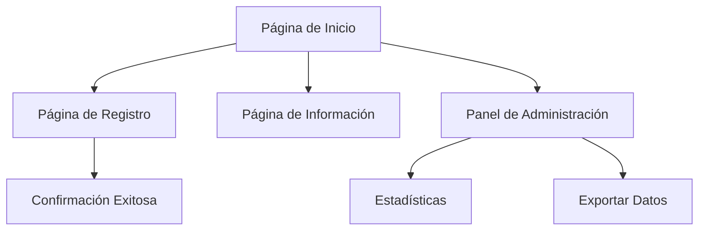

# Documento de Requerimientos del Producto - Sitio Web de Registro de Invitados para Boda

## 1. Resumen del Producto

Sitio web elegante para el registro y confirmación de asistencia de invitados a una boda, desarrollado con React y diseñado con una paleta de colores beige sofisticada.

El producto permite a los novios gestionar eficientemente las confirmaciones de asistencia, recopilar información de los invitados y proporcionar detalles importantes del evento a través de una interfaz web intuitiva y visualmente atractiva.

## 2. Características Principales

### 2.1 Roles de Usuario

| Rol                    | Método de Registro              | Permisos Principales                                                    |
| ---------------------- | ------------------------------- | ----------------------------------------------------------------------- |
| Invitado               | Código de invitación único      | Puede confirmar asistencia, actualizar información personal             |
| Administrador (Novios) | Acceso directo con credenciales | Puede ver todas las confirmaciones, gestionar invitados, exportar datos |

### 2.2 Módulo de Características

Nuestro sitio web de registro de boda consta de las siguientes páginas principales:

1. **Página de Inicio**: sección hero con información de la boda, navegación principal, formulario de acceso rápido.
2. **Página de Registro**: formulario de confirmación de asistencia, selección de menú, información de acompañantes.
3. **Página de Información**: detalles del evento, ubicación, horarios, código de vestimenta.
4. **Panel de Administración**: lista de invitados confirmados, estadísticas de asistencia, exportación de datos.

### 2.3 Detalles de Páginas

| Nombre de Página        | Nombre del Módulo           | Descripción de Características                                                           |
| ----------------------- | --------------------------- | ---------------------------------------------------------------------------------------- |
| Página de Inicio        | Sección Hero                | Mostrar nombres de los novios, fecha y ubicación de la boda con imagen de fondo elegante |
| Página de Inicio        | Navegación Principal        | Menú de navegación con enlaces a registro, información y galería                         |
| Página de Inicio        | Formulario de Acceso Rápido | Campo para ingresar código de invitación y acceder directamente al registro              |
| Página de Registro      | Formulario de Confirmación  | Recopilar confirmación de asistencia (sí/no), nombre completo, email, teléfono           |
| Página de Registro      | Selección de Menú           | Opciones de menú (vegetariano, sin gluten, estándar) y alergias alimentarias             |
| Página de Registro      | Información de Acompañantes | Agregar detalles de acompañantes si aplica                                               |
| Página de Información   | Detalles del Evento         | Mostrar cronograma del día, ubicaciones de ceremonia y recepción                         |
| Página de Información   | Mapa y Direcciones          | Integración con mapas para mostrar ubicaciones y direcciones                             |
| Página de Información   | Código de Vestimenta        | Especificar el dress code y sugerencias de vestimenta                                    |
| Panel de Administración | Lista de Invitados          | Ver todos los invitados registrados con estado de confirmación                           |
| Panel de Administración | Estadísticas                | Mostrar gráficos de confirmaciones, preferencias de menú, total de asistentes            |
| Panel de Administración | Exportación de Datos        | Descargar lista de invitados en formato CSV/Excel                                        |

## 3. Proceso Principal

**Flujo del Invitado:**
El invitado recibe un código de invitación único, accede al sitio web, ingresa su código, completa el formulario de registro con su confirmación de asistencia y preferencias, y recibe una confirmación por email.

**Flujo del Administrador:**
Los novios acceden al panel de administración, revisan las confirmaciones recibidas, consultan estadísticas de asistencia, y exportan la información para la planificación del evento.

## 4. Diseño de Interfaz de Usuario

### 4.1 Estilo de Diseño

* **Colores primarios**: Beige (#F5F5DC), Champagne (#F7E7CE), Marfil (#FFFFF0)

* **Colores secundarios**: Dorado suave (#D4AF37), Marrón claro (#D2B48C)

* **Estilo de botones**: Redondeados con sombras suaves y efectos hover elegantes

* **Tipografía**: Fuentes serif elegantes para títulos (Playfair Display), sans-serif para texto (Lato)

* **Tamaños de fuente preferidos**: H1: 2.5rem, H2: 2rem, Texto: 1rem

* **Estilo de layout**: Diseño centrado con tarjetas, navegación superior fija

* **Iconos**: Iconos minimalistas en estilo line art, elementos florales sutiles

### 4.2 Resumen de Diseño de Páginas

| Nombre de Página        | Nombre del Módulo          | Elementos de UI                                                                          |
| ----------------------- | -------------------------- | ---------------------------------------------------------------------------------------- |
| Página de Inicio        | Sección Hero               | Fondo con imagen de pareja, overlay beige semitransparente, tipografía elegante centrada |
| Página de Registro      | Formulario de Confirmación | Tarjeta centrada con campos de entrada estilizados, botones con gradiente beige          |
| Página de Información   | Detalles del Evento        | Layout de dos columnas, iconos temáticos, tarjetas con bordes dorados sutiles            |
| Panel de Administración | Estadísticas               | Gráficos en tonos beige y dorado, tablas con alternancia de colores suaves               |

### 4.3 Responsividad

Diseño mobile-first con adaptación completa para dispositivos móviles, tablets y desktop. Optimización táctil para formularios en dispositivos móviles.

## 5. Consideraciones Técnicas

* Validación de formularios en tiempo real

* Almacenamiento local para guardar progreso del formulario

* Integración con servicios de email para confirmaciones

* Optimización SEO básica

* Accesibilidad web (WCAG 2.1 AA)

